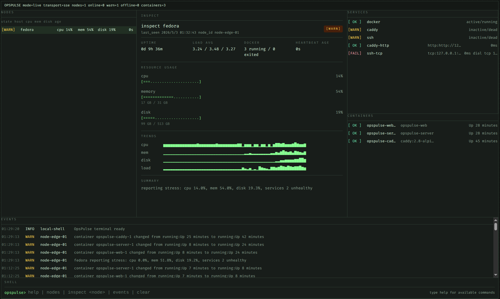

# OpsPulse

OpsPulse is a terminal-first homelab heartbeat console powered by a lightweight Go agent.

OpsPulse 是一个本地优先（local-first）的轻量级 DevOps Dashboard + Agent 系统。

核心原则：**节点数据只能来自真实的宿主机 Agent 上报**。

- `agent` 不跑在 Docker Compose 里
- `server/web/caddy` 可以通过 Docker Compose 运行
- 没有真实 Agent 时，Dashboard 会显示空状态，而不是伪造 demo 节点

当前 v0.1 只做真实 Agent 上报的节点、资源、服务和事件展示。



## Current Scope

- node heartbeat
- CPU / memory / disk / load
- Docker running/exited count
- systemd whitelist services
- SSE event stream
- Caddy behind existing Nginx

## Not Goals

- remote command execution
- Prometheus replacement
- full monitoring platform
- fake demo data
- complex alerting system

## v0.1 Checklist

- [x] terminal-first console layout
- [x] real Agent heartbeat ingestion
- [x] CPU / memory / disk / load telemetry
- [x] Docker summary and container detail pane
- [x] systemd whitelist service pane
- [x] HTTP / TCP checks
- [x] SSE event stream
- [x] event de-noising on state change
- [x] Compose deployment behind existing reverse proxy
- [ ] screenshot capture for `docs/screenshot.png`

## 本地开发

### 环境要求

- Go 1.23+
- Node.js 22+
- npm 10+

### 1. 启动 Server

```bash
cd server
OPS_AGENT_TOKEN=change-me go run ./cmd/server
```

默认监听 `http://localhost:8080`。

### 2. 启动前端

```bash
cd web
npm install
npm run dev -- --host
```

打开 `http://localhost:5173`。

前端默认通过相对路径访问 `/api` 和 `/healthz`，开发模式下由 Vite 自动代理到 `http://localhost:8080`。

### 3. 启动宿主机 Agent

先按宿主机环境创建配置文件，例如：

```yaml
node_id: node-local-01
server_url: http://localhost:8080
token: change-me
interval: 15s
docker_enabled: true
service_whitelist:
  - docker
  - ssh
```

然后运行：

```bash
cd agent
go run ./cmd/agent --config /path/to/agent.yaml
```

说明：

- 只有宿主机 Agent 启动并开始上报后，Dashboard 才会显示节点
- 如果没有任何 Agent，节点 pane 会显示空状态提示，这是预期行为

## 命令栏交互

Dashboard 底部提供 `opspulse>` 命令栏，仅用于前端本地交互，不执行任何远程命令。

支持命令：

- `help`
- `nodes`
- `inspect <nodeId|hostname>`
- `events`
- `clear`

## Docker Compose

Compose 只负责：

- `server`
- `web`
- `caddy`

不负责启动 Agent。

### 启动

```bash
export OPS_AGENT_TOKEN='replace-with-long-random-token'
docker compose up -d --build
```

如果构建环境访问 `proxy.golang.org` 较慢或不可达，可以显式指定 Go 模块代理：

```bash
docker compose build --build-arg GOPROXY=https://goproxy.cn,direct server
docker compose up -d
```

Compose 中保留了 Caddy，但它只作为 OpsPulse 内部入口，不占用宿主机 `80/443`。

默认映射：

```text
127.0.0.1:8090 -> caddy:80
```

可通过环境变量自定义：

```bash
export OPS_CADDY_PORT=8090
```

访问方式：

- `http://127.0.0.1:8090/`

路由规则：

- `/api/*`、`/healthz` -> `server:8080`
- 其他路径 -> `web:3000`

### 让 Compose 页面显示真实节点

必须额外在宿主机上启动 Agent，并让它指向 Compose 内的 Server。

示例配置：

```yaml
node_id: node-host-01
server_url: http://127.0.0.1:8090
token: replace-with-long-random-token
interval: 15s
docker_enabled: true
service_whitelist:
  - docker
  - ssh
  - caddy
```

然后在宿主机执行：

```bash
cd agent
go build -o opspulse-agent ./cmd/agent
./opspulse-agent --config /path/to/agent.yaml
```

注意：如果 `server_url` 指向 `http://127.0.0.1:8090`，Agent 走的是 Caddy 入口；如果你希望直接连接 Server，也可以指向 `http://127.0.0.1:8080`，前提是你自己暴露了该端口。

## 已有 Nginx 反代示例

如果宿主机已经有 Nginx，可把公网域名或内网入口反代到 `127.0.0.1:8090`：

```nginx
server {
    listen 80;
    server_name ops.example.com;

    location / {
        proxy_pass http://127.0.0.1:8090;
        proxy_http_version 1.1;
        proxy_set_header Host $host;
        proxy_set_header X-Real-IP $remote_addr;
        proxy_set_header X-Forwarded-For $proxy_add_x_forwarded_for;
        proxy_set_header X-Forwarded-Proto $scheme;
        proxy_set_header Upgrade $http_upgrade;
        proxy_set_header Connection "upgrade";
    }
}
```

## Agent 配置

部署示例配置：`agent/agent.example.yaml`

Agent 保持单二进制运行，支持 YAML 配置文件，主动向 Server 上报：

- hostname
- uptime
- CPU usage
- memory usage
- disk usage
- load average
- metrics history for recent heartbeats
- Docker running/exited container count and container details
- systemd service status from whitelist
- HTTP/TCP health checks from whitelist-style config

## API 概览

- `POST /api/v1/agents/heartbeat`：Agent 心跳上报（Bearer Token 鉴权）
- `GET /api/v1/overview`：Dashboard 总览
- `GET /api/v1/nodes`：节点列表
- `GET /api/v1/nodes/:nodeId`：节点详情
- `GET /api/v1/events`：事件时间线
- `GET /api/v1/stream`：SSE 实时流
- `GET /healthz`：健康检查

## systemd Agent 示例

服务文件见：`deploy/systemd/opspulse-agent.service`

## 安全说明

- Agent 与 Server 通过 Bearer Token 鉴权。
- 前端命令栏只做本地 UI 交互，不实现远程命令执行。
- Dashboard 不返回真实来源 IP。
- 不伪造 demo 节点，不在没有 Agent 的情况下伪装系统已接入。

## 后续扩展

当前代码结构仍然保留了后续扩展边界，可继续增加：

- Kubernetes 集群状态
- GitHub Actions / Gitea Actions 概览
- 历史指标图表
- 日志检索
- 受限控制操作
